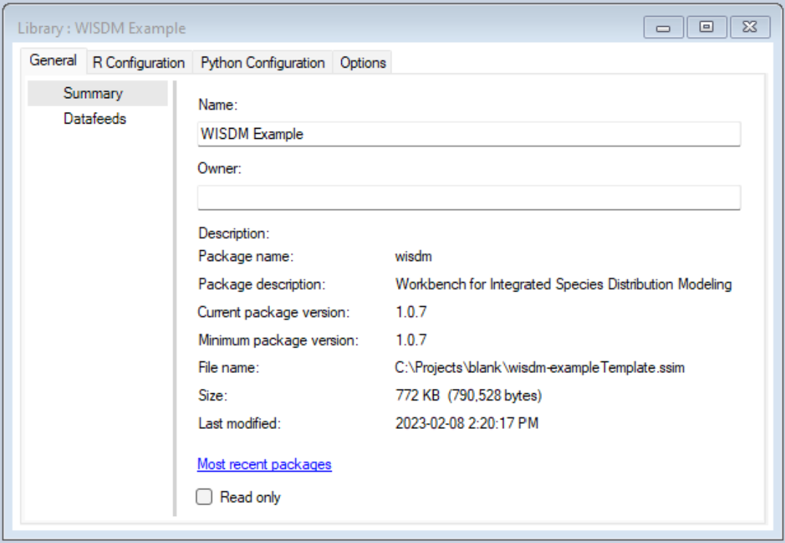
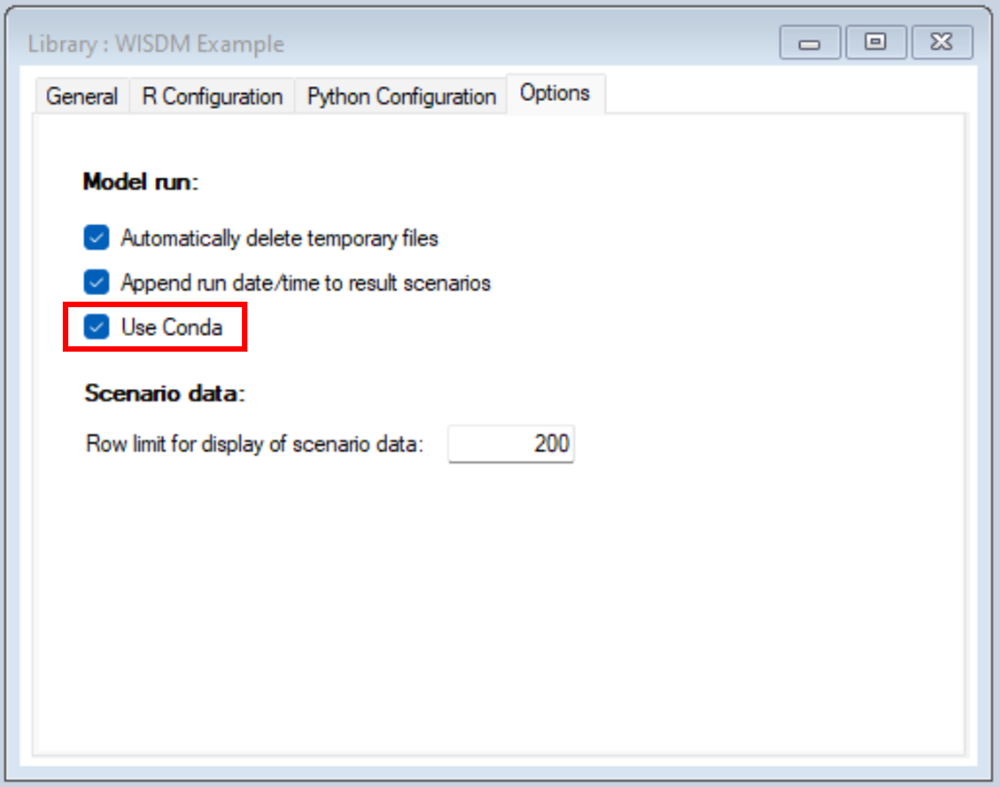
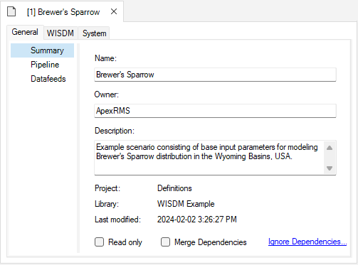
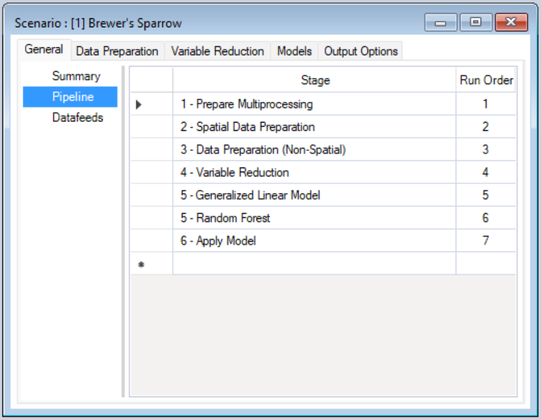
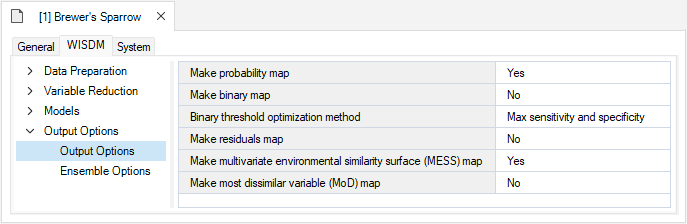
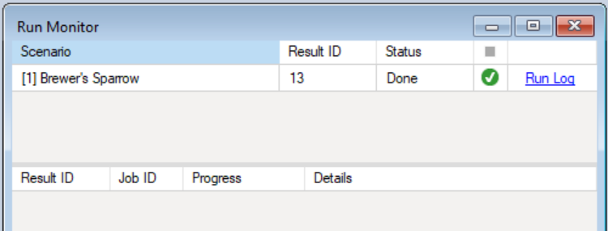
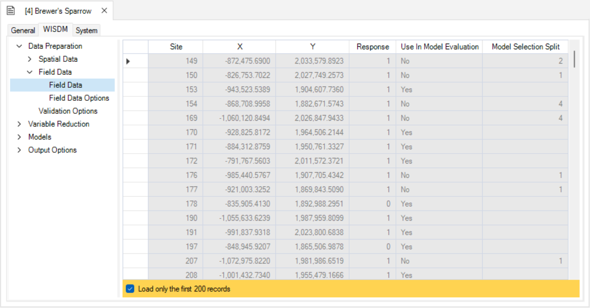
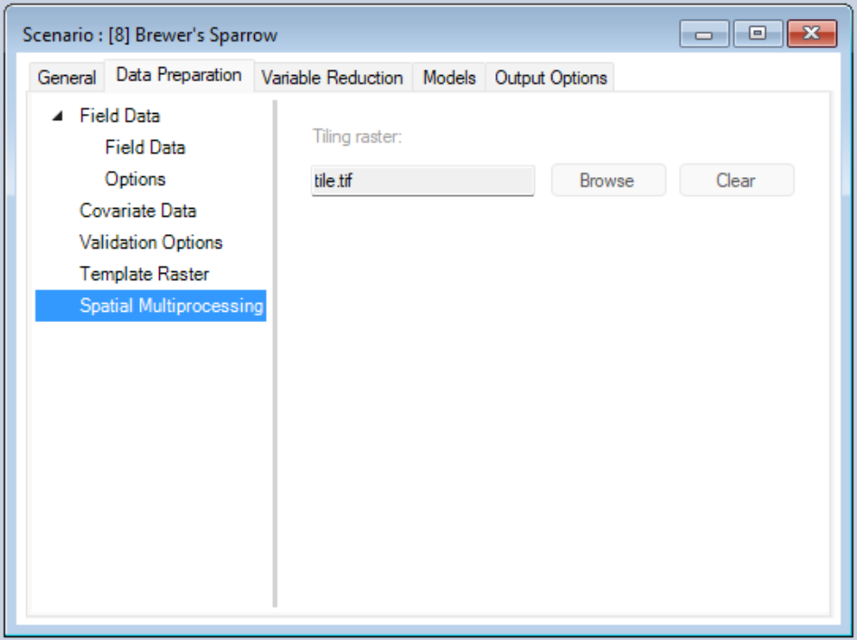
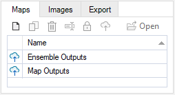
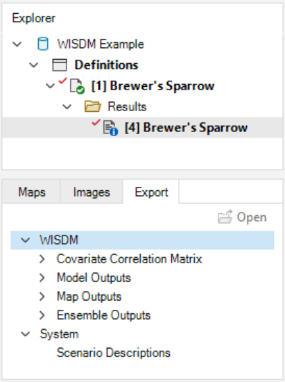

# Getting started with **WISDM**

### Here we provide a guided tutorial on **WISDM**, an open-source package for developing and visualizing species distribution models (SDMs).

**WISDM** is built as a base package for SyncroSim, yet familiarity with SyncroSim is not required to get started with **WISDM**. Throughout the Quickstart tutorial, terminology associated with SyncroSim will be italicized, and whenever possible, links will be provided to the SyncroSim online documentation. For more on SyncroSim, please refer to the SyncroSim [Overview](https://docs.syncrosim.com/getting_started/overview.html){:target="_blank"} and [Quickstart tutorial](https://docs.syncrosim.com/getting_started/quickstart.html){:target="_blank"}.

 

## **WISDM** Quickstart Tutorial

This quickstart tutorial will introduce you to the basics of working with **WISDM**. The steps include:

1. Installing **WISDM** 
2. Creating a new **WISDM** Library
3. Viewing model inputs
4. Running models
5. Viewing model results

 

## Step 1: Installing **WISDM** 

Running **WISDM** requires that the SyncroSim software be installed on your computer. Download the latest version of SyncroSim <a href="https://syncrosim.com/download/" target="_blank">here</a> and follow the installation prompts.

**WISDM** is a [*Base Package*](https://docs.syncrosim.com/how_to_guides/package_overview.html){:target="_blank"} within the SyncroSim simulation modeling framework. To install the **WISDM** *Package*, open SyncroSim and select **File** > **Packages** > **Install**, then select the **WISDM** *Package* and click OK.

Alternatively, download the <a href="" target="_blank">latest release</a> from GitHub. Open SyncroSim and select **File** > **Packages** > **Install From File...**, then navigate to the downloaded *Package* file with the extension *.ssimpkg*.

If you do not have **Miniconda** installed on your computer, a dialog box will open asking if you would like to install Miniconda. Click **Yes**. Once Miniconda is done installing, a dialog box will open asking if you would like to create a new conda environment. Click **Yes**.

> **Miniconda** is an installer for conda, a package environment management system that installs any required packages and their dependencies. By default, **WISDM** runs conda to install, create, save, and load the required environment for running **WISDM**. The **WISDM** enviornment includes <a href="https://www.r-project.org/" target="_blank">**R**</a> and <a href="https://www.python.org/" target="_blank">**Python**</a> software and associated packages.

## Step 2: Create a new **WISDM** Library

Having installed the **WISDM** *Package*, you are now ready to create your SyncroSim *Library*. A *Library* is a file (with extension *.ssim*) that contains all your model inputs and outputs. Note that the format of each *Library* is specific to the *Package* for which it was initially created. You can opt to create an empty *Library* or use a template *Library* called **_WISDM Example_**. In this tutorial, we will be working with the **_WISDM Example_** template *Library*. To create a new *Library* from this template, choose **New...** from the **File** menu.

 

 

In this window:

* Select the row for **wisdm - Workbench of Integrated Species Distribution Modeling**. Note that as you select a row, the list of *Templates* available and suggested **File name** for that base package are updated.
* Select the **_WISDM Example_** template as shown above. 
* Optionally type in a new **File name** for the *Library* (or accept the default); you can also change the **Folder** containing the file using the **Browse…** button.  
* When you are ready to create the Library file, click **OK**. A new *Library* will be created and loaded into the Library Explorer.

## Step 3: Viewing model inputs

The contents of your newly created Library are now displayed in the Library Explorer. The *Library* stores information on three levels: the *Library*, the *Project*, and the *Scenarios*. 

To view the details of the *Library*:

* Select the *Library* name (**_WISDM Example_**) in the Library Explorer.
* Right-click and choose **Properties** from the context menu to view the details of the *Library*.
 

This opens the *Library Properties* window.

 

   

The *Library* stores information that applies to all *Projects* and *Scenarios* stored within. In particular, the *Library Properties* contains information on whether to use the <a href="https://docs.conda.io/en/latest/" target="_blank">conda package manager</a>. To activate the use of conda, simply select the **Use Conda** option in the **Options** tab (see below).

 

   

Most model inputs in SyncroSim are organized into *Scenarios*, where each *Scenario* consists of a suite of values, one for each of the Model’s required inputs. Because you chose the **_WISDM Example_** when you created your *Library*, your Library already contains pre-configured *Scenarios* with model inputs. The purpose of these *Scenarios* is to demonstrate different types of model inputs and use cases.

 

   

To view the details of the *Scenario*:

* Select the scenario named **_Brewer's Sparrow_** in the Library Explorer.
* Right-click and choose **Properties** from the context menu to view the details of the Scenario.
 

This opens the *Scenario Properties* window.

 

   

### Pipeline

Located underneath the **General** tab, the model **Pipeline** allows you to select which stages of the model to include in the model run and their run order. A full run of **WISDM** consists of five or six stages: (1) Create multiprocessing tiles; (2) Prepare spatial data; (3) Prepare non-spatial data; (4) Reduce variables; (5) Fit statistical model(s); (6) Apply the model(s). In this example, we will run the full *Pipeline* including two statistical models in Stage 5:

* Stage 1: Prepare Multiprocessing 
* Stage 2: Spatial Data Preparation
* Stage 3: Data Preparation (Non-Spatial)
* Stage 4: Variable Reduction
* Stage 5.1: Generalized Linear Model
* Stage 5.2: Random Forest
* Stage 5.3: Maxent
* Stage 6: Apply Model

 

   

Note that all stages in this *Pipeline* are dependent on the results of the previous stage. You cannot run a stage without having first run the previous stage. However, you can chose to fit your data to any number of the statistical models available for Stage 5 (i.e., GLM, Random Forest, or Maxent). In this example, GLM and Random Forest have been selected and added to the *Pipeline*.  

 

   

### Spatial Multiprocessing Inputs

Under the **Data Preparation** tab, you'll find the **Template Raster** datasheet. Here, you'll choose a *Raster File* that provides a template of the desired extent, resolution, and crs for the analysis and outputs. You can also choose to specify a *Number of Multiprocessing Tiles*. If you don't specify a value, the package will select an appropriate value. 

 

   

Note that Stage 1 (Prepare Multiprocessing) only needs to be added to the *Pipeline* and run if spatial multiprocessing is required (i.e., for large landscapes and/or high resolution data). In this example, we will use spatial multiprocessing for demonstration purposes. 

### Spatial Data Inputs

Under the **Project Properties**, which you can view by double-clicking the *Project* called *Definitions*, you'll find the **Covariates** datasheet. Here, you must list the names of all covariates you want to consider for model development.

 

   

If you return to the **Scenario Properties**, under the **Data Preparation** tab, you'll also find a datasheet called **Covariate Data**. Here, you will provide rasters (.tif files) for each covariate of interest identified in the **Covariates** datasheet above. The extent of each raster must be greater than or equal to the template raster extent.

 

   

In the same **Data Preparation** tab, you'll also find a **Field Data** datasheet. Here, you will identify site locations by their X and Y coordinates and include response values for the target species. Response values can be provided as presence-only (1), presence/absence (1 or 0), or counts (integers >= 0). 

 

   

By default, WISDM assumes that the field data coordinates are provided in the template raster's reference system. If the coordinates are provided in an alternate reference system, the corresponding authority code should be entered under the field data **Options** datasheet. 

 

   

The *Aggregate or Weight Data* input gives you the option to handle redundancy and avoid pseudo-replication by either aggregating field data locations so only one field data observation is represented per pixel or down-weighting multiple points proportionately. If the input is left blank, all field data points will be retained. That is, no aggregation or weighting occurs.

### Field Data Inputs

Still under the **Data Preparation** tab, you'll find the **Validation Options** datasheet. Here, you'll indicate if data should be split into training and testing datasets and the proportion of data that should be used for training. If left blank all data is used for training and no data is reserved for testing. In this datasheet, you will also indicate if cross validation should be used, the number of folds the data should be split into (the default is 10), and if the data in the folds should be stratified by the response (i.e., relatively equal representation of the response variables in each fold). If left blank cross validation will not run.  

 

   

### Statistical Models

In the **Models** tab, you'll find the **GLM**, **Random Forest**, and **Maxent** datasheets. Depending on which statistical models you included in your *Pipeline*, you can access the corresponding model configuration datasheet here and customize your desired statistical analysis. If fields are left blank, default values will be used. 

 

  

 

   

### Output Options

In the **Output Options** datasheet, you can choose which output maps to generate. Four output options are available for selection: (1) Probability Map, (2) Residuals Map, (3) Multivariate Environmental Similarity Surface (MESS) Map, (4) Most Dissimilar Variable (MoD) Map.

 

   

## Step 4: Running models

Right-click on the **_Brewer's Sparrow Scenario_** in the **Scenario Manager** window and select **Run** from the context menu. If prompted to save your project click **Yes**. Note that Stage 1 must be added to the *Pipeline* for spatial multiprocessing to run.

During the model run, a **Covariate Correlation Viewer** window will appear showing correlations between *Covariates*. You can opt to remove covariates from consideration if the correlation values are deemed unacceptable. To remove a *Covariate*, simply uncheck the variable from the *Covariates to include:* list. A default threshold correlation value of 0.7 is used to color code the correlation values. This value, and the number of plots shown, can be changed. To view  changes, simply select the *Update* button. Once you are satisfied with your list of covariates, select the *Save & Close* button. The window will close and the analysis will continue.

 

   

The run should complete quickly. If the run is successful you will see a Status of **Done** in the **Run Monitor** window, at which point you can close the **Run Monitor** window; otherwise click on the **Run Log** link to see a report of any problems, make any necessary changes to your Scenario, and then re-run the Scenario.

 

   

## Step 5: Viewing the outputs and results

Once the run is completed, you can view the details of the *Result Scenario*:

* Select **_Brewer's Sparrow Result Scenario_** from the *Results* folder nested under the **_Brewer's Sparrow Scenario_** in the Library Explorer.
 

 

   

* Right-click and choose **Properties** from the context menu to view the details of the *Result Scenario*.

 

   

This opens the *Result Scenario Properties* window. The format of the *Result Scenario Properties* is similar to the *Scenario Properties* but contains read-only datasheets with updated information produced during the model run.

Look through the *Result Scenario* to see the updated or newly populated datasheets. You should find that the **Field Data**, **Covariate Data**, **GLM**, and **Random Forest** datasheets have updated entries. Note that the model configuration options for both **GLM** and **Random Forest** were left empty in the *Parent Scenario*. In this case, **WISDM** uses default settings during model fitting and reports the selections in the *Result Scenario*.

 

   

### Field Data Outputs

The **Field Data** datasheet has also been updated to only include sites inside the extent of the *template raster*. In the **Options** datasheet below, if weight was selected, the *Weights* column will be populated. If aggregate was selected, records with -9999 may occur in the *Response* column, this indicates redundancy, and these records are removed from model fitting.

 

   

### Covaraite Data Outputs

Back in the **Covariate Data** datasheet, you'll find that all your input rasters have been replaced by clipped, reprojected, and resampled rasters that match the properties of your *template raster*. The *Resample Method* and *Aggregation Method* columns have been populated to indicate which approach was used to prepare the data.

 

   

In the *Results Scenario* you should also find that the **Spatial Multiprocessing**, **Site Data**, and **Reduced Covaritate List** datasheets are now populated. **Site Data** is an output of the *Spatial Data Preparation* stage of the *Pipeline* and provides site specific values for each covariate. The **Reduced Covariate List** is an output of the **Variable Reduction** stage of the *Pipeline* and reports the candidate variables that were considered during model fitting.  

### Spatial Multiprocessing Outputs

Since we opted for multiprocessing, we can see that a tiling raster has been created and added to the **Spatial Multiprocessing** datasheet. This tiling raster is used to clip other spatial layers into smaller rectangular blocks effectively creating more manageable processing sizes. 

 

   

### Visual Outputs

To view spatial outputs, move to the results panel at the bottom left of the **Library Explorer** window. Under the **Maps** tab, double-click on **Map Outputs** to visualize the map.

 

   

The first two maps are *Probability* maps demonstrating species occurrence probabilities spatially. Values in the legend on the left-hand side of the screen represent probabilities as percentages. The two maps represent outputs using *GLM* and *Random Forest* statistical analyses. If you only opted for one of the two statistical methods in the model *Pipeline*, only one map will be visible.

 

   

Under the **Maps** tab, you will also find the **Model Outputs**. Outputs include *Response Curves*, *Standard Residuals*, *Residuals Smooth*, *Calibration*, *ROC/AUC*, *AUCPR*, *Confusion Matrix*, and *Variable Importance*. These outputs provide information on model performance and offer quick comparison of different statistical models. 

 

   

## Export Data

To export a map or model output created by the **WISDM** package, add the *Result Scenario* with the desired outputs to the results, then open the **Export** tab at the bottom of the screen. All available files for export will be listed. To export, simply double-click on the desired output and choose the directory in which to save the file in the pop-up window. Note that if multiple *Result Scenarios* are included in the active *Result Scenarios*, files for each of the selected scenarios will exported. 

 

   
