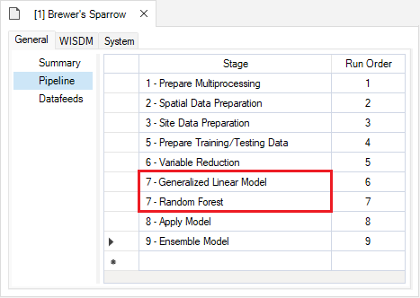
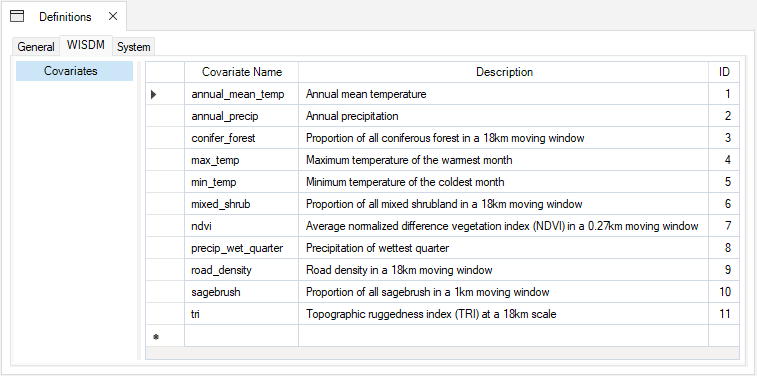
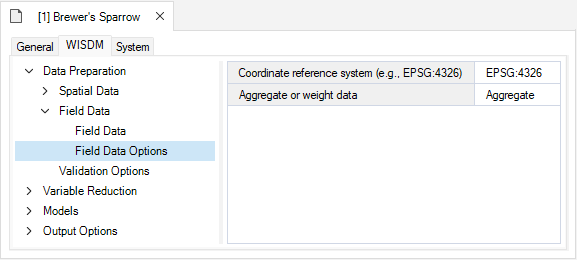
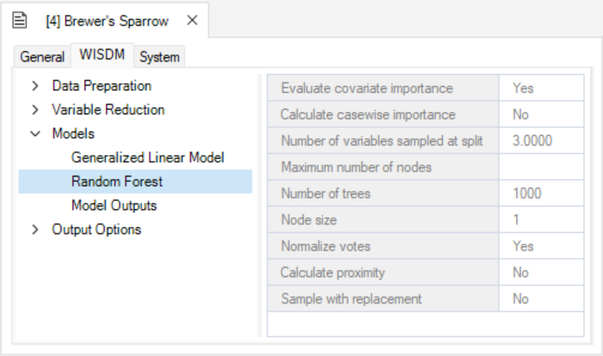

# Getting started with **WISDM**

---
## ⚠️ **Notice to Users**

The **Getting Started** documentation and associated **Tutorials** for this SyncroSim package currently reflects information for **SyncroSim version 2**. We are in the process of updating these pages to ensure compatibility with **SyncroSim version 3**.
In the meantime, please note that some instructions, references, and/or images may not fully align with the latest version of SyncroSim. We appreciate your patience as we work to provide updated resources.

---

### Here we provide a guided tutorial on **WISDM**, an open-source package for developing and applying species distribution models (SDMs) and visualizing their outputs.

**WISDM** is a base package for SyncroSim, yet familiarity with SyncroSim is not required to get started with **WISDM**. Throughout the Quickstart tutorial, terminology associated with SyncroSim is italicized, and whenever possible, links are provided to the SyncroSim online documentation. For more on SyncroSim, please refer to the SyncroSim [Overview](https://docs.syncrosim.com/getting_started/overview.html){:target="_blank"} and [Quickstart tutorial](https://docs.syncrosim.com/getting_started/quickstart.html){:target="_blank"}.

 

## **WISDM** Quickstart Tutorial

This quickstart tutorial will introduce you to the basics of working with **WISDM**. The steps include:

1. <a href="#step1">Installing **WISDM**</a>
2. <a href="#step2">Creating a new **WISDM** Library</a>
3. <a href="#step3">Viewing model inputs</a> 
4. <a href="#step4">Running models</a>
5. <a href="#step5">Viewing model outputs and results</a>

 

 <h2>Step 1: Installing <b>WISDM</b></h2> 

Running **WISDM** requires that the SyncroSim software be installed on your computer. Download the latest version of SyncroSim <a href="https://syncrosim.com/download/" target="_blank">here</a> and follow the installation prompts.

**WISDM** is a [*Base Package*](https://docs.syncrosim.com/how_to_guides/package_overview.html){:target="_blank"} within the SyncroSim simulation modeling framework. To install the **WISDM** *Package*, open SyncroSim and select **File** > **Packages** > **Install**, then select the **WISDM** *Package* and click OK.

If you do not have **Miniconda** installed on your computer, a dialog box will open asking if you would like to install Miniconda. Click **Yes**. Once Miniconda is done installing, a dialog box will open asking if you would like to create a new conda environment. Click **Yes**. Note that the process of installing Miniconda and the **WISDM** conda environment can take several minutes. If you choose not to install the conda environment you will need to manually install all required package dependencies.

> **Miniconda** is an installer for conda, a package environment manager that installs any required packages and their dependencies. By default, **WISDM** runs conda to install, create, save, and load the required environment for running **WISDM**. The **WISDM** environment includes <a href="https://www.r-project.org/" target="_blank">**R**</a> and <a href="https://www.python.org/" target="_blank">**Python**</a> software and associated packages.

 

 <h2>Step 2: Creating a new <b>WISDM</b> Library</h2> 

Having installed the **WISDM** *Package*, you are now ready to create your SyncroSim *Library*. A *Library* is a file (with extension *.ssim*) that contains all your model inputs and outputs. Note that the format of each *Library* is specific to the *Package* for which it was initially created. You can opt to create an empty *Library* or use a template *Library* called **_WISDM Example_**. In this tutorial, we will be working with the **_WISDM Example_** template *Library*. To create a new *Library* from this template, choose **New...** from the **File** menu.

In this window:

* Select the row for **wisdm - Workbench of Integrated Species Distribution Modeling**. Note that as you select a row, the list of *Templates* available and suggested **File name** for that base package are updated.
* Select the **_WISDM Example_** template as shown above. 
* Optionally type in a new **File name** for the *Library* (or accept the default); you can also change the **Folder** containing the file using the **Browse…** button.  
* When you are ready to create the Library file, click **OK**. A new *Library* will be created and loaded into the **Library Explorer**.

 

 <h2>Step 3: Viewing model inputs</h2> 

The contents of your newly created Library are now displayed in the **Library Explorer**. The *Library* stores information on three levels: the *Library*, the *Project*, and the *Scenarios*. 

Most model inputs in SyncroSim are organized into *Scenarios*, where each *Scenario* consists of a suite of *Properties*, one for each of the model’s required inputs. Because you chose the **_WISDM Example_** when you created your *Library*, your Library already contains a demonstration *Scenario* with pre-configured model inputs and outputs. 

To view the details of the *Scenario*:

* Select the scenario named **_Brewer's Sparrow_** in the **Library Explorer**.
* Right-click and choose **Properties** from the context menu to view the details of the Scenario.

This opens the *Scenario Properties* window.

 

### Pipeline

Located underneath the **General** tab, the model **Pipeline** allows you to select which stages of the model to include in the model run and their run order. A full run of **WISDM** consists of six to nine stages: (1) Create multiprocessing tiles (optional); (2) Prepare spatial data; (3) Prepare site data; (4) Generate background sites (optional); (5) Prepare training and testing data; (6) Variable reduction; (7) Fit statistical model(s); (8) Apply the model(s); (9) Ensemble the models (optional). The following list represents all possible *Pipeline* elements. In this example, however, we will only run two statistical models in Stage 7:

* Stage 1: Prepare Multiprocessing (optional)
* Stage 2: Spatial Data Preparation
* Stage 3: Site Data Preparation
* Stage 4: Background Data Generation (optional)
* Stage 5: Prepare Training/Testing data
* Stage 6: Variable Reduction
* Stage 7: Generalized Linear Model
* Stage 7: Boosted Regression Tree
* Stage 7: Random Forest
* Stage 7: Maxent
* Stage 8: Apply Model
* Stage 9: Ensemble Model (optional)

Note that all stages in this *Pipeline* are dependent on the results of the previous stage. You cannot run a stage without having first run the previous required stages (optional stages can be skipped). However, you can choose to fit your data to any number of the statistical models available for Stage 7 (i.e., GLM, Random Forest, or Maxent). In this example, GLM and Random Forest have been selected and added to the *Pipeline*.  

 

### Spatial Multiprocessing Inputs

Under the **Data Preparation** tab, you'll find the **Template Raster** datasheet. Here, you'll provide the system path to a *Raster File* with the desired extent, resolution, and coordinate reference system (CRS) for the analysis and outputs. This **Template Raster** is required for multiple stages in the *Pipeline*, including the optional Prepare Multiprocessing stage. 

If you are choosing to run with Spatial Multiprocessing, you can also specify the *Number of Multiprocessing Tiles* that you would like to use. If you don't specify a value, the package will select an appropriate value for you. 

If spatial multiprocessing is used, a tiling raster will be created and will appear in the **Spatial Multiprocessing** datasheet when the **Scenario** has finished running. This tiling raster is used to clip other spatial layers into smaller rectangular blocks, effectively creating more manageable processing sizes.

Note that Stage 1 (Prepare Multiprocessing) only needs to be added to the *Pipeline* and run if spatial multiprocessing is required (i.e., for large landscapes and/or high resolution data). In this example, we will use spatial multiprocessing for demonstration purposes. 

 

### Spatial Data Inputs

Under the **Project Properties**, which you can view by double-clicking in the **Library Explorer** window, in the *Project* called *Definitions*, you'll find the **Covariates** datasheet. Here, you must list the names of all covariates you want to consider for model development.

If you return to the **Scenario Properties**, under the **Data Preparation** tab, you'll also find a datasheet called **Covariate Data**. Here, you will identify system paths to the raster files (e.g., GEOTiffs) for each covariate listed in the **Covariates** datasheet above. The extent of each raster must be greater than or equal to the template raster extent.

Below the **Covariate Data** datasheet, you will see a **Restriction Raster** datasheet. This is an optional input, where you can specify a file path to a raster that will be used to multiply the probability raster during the apply model stage. The **Restriction Raster** is often binary, with the value of 0 indicating areas where occurrence probability will be reduced to zero. In addition to providing a file, you can provide a brief description of the **Restriction Raster** used.

In the same **Data Preparation** tab, you'll also find a **Field Data** datasheet. Here, you will identify site locations by their X and Y coordinates and include response values for the target species. Response values can be provided as presence-only (1), presence/absence (1 or 0), or counts (integers >= 0).  

By default, **WISDM** assumes that the field data coordinates are provided in the template raster's reference system. If the coordinates are provided in an alternate coordinate reference system, the corresponding authority code should be entered under the field data **Field Data Options** datasheet. 

The *Aggregate or Weight Data* input gives you the option to handle redundancy and avoid pseudo-replication by either aggregating field data locations so only one field data observation is represented per pixel or proportionately down-weighting pixels with multiple points. If the input is left blank, all field data points will be retained without aggregation or weighting.

If the *Background Data Generation* stage is included in the Scenario *Pipeline*, the **Background Data Options** datasheet will be visible below the **Field Data Options** datasheet. Here, you can identify preferences for background site or pseudo-absence generation, such as whether background sites should be generated, the number of sites that should be generated, the method used for generation, KDE (kernel density estimation) background surface method, and the isopleth threshold used for binary mask creation. This datasheet is optional and is left blank for the purposes of this tutorial.

 

### Field Data Inputs

Still under the **Data Preparation** tab, you'll find the **Validation Options** datasheet. Here, you'll indicate if data should be split into training and testing datasets and the proportion of data that should be used for training. If left blank all data is used for training and no data is reserved for testing. In this datasheet, you can also indicate if cross validation (CV) should be used, the number of CV folds the data should be split into (the default is 10), and if the data in the folds should be stratified by the response (i.e., relatively equal representation of the response variables in each fold). If *Use cross validation for model selection* is left blank, cross validation will not run.  

 

### Statistical Models

In the **Models** tab, you'll find the **GLM**, **Random Forest**, and **Maxent** datasheets. Depending on which statistical models you included in your *Pipeline*, you can access the corresponding model configuration datasheet here and customize your desired statistical analysis. If fields are left blank, default values will be used. 

  

### Output Options

In the **Output Options** datasheet, you can choose which output maps to generate. Five output options are available for selection: (1) Probability Map, (2) Binary Map, (3) Residuals Map, (4) Multivariate Environmental Similarity Surface (MESS) Map, and (5) Most Dissimilar Variable (MoD) Map. Choosing at least one option is required to produce output maps. If this datasheet is left blank, the probability map will be generated by default and all other maps will not be generated. 

 

 <h2>Step 4: Running models</h2> 

Right-click on the **_Brewer's Sparrow Scenario_** in the **Scenario Manager** window and select **Run** from the context menu. If prompted to save your project, click **Yes**. 

During the model run, the **Covariate Correlation Viewer** window will open in your default browser, showing correlations between *Covariates*. Here, you can manually remove covariates from consideration based on user interpretation (e.g., if the correlation values are deemed unacceptable). To remove a *Covariate*, uncheck the box next to the variable name in the *Covariates to include* list. A default threshold correlation value of |0.7| (highest of Spearman, Pearson, Kendall) is used to color code the correlation values. This value, and the number of plots shown, can be changed. To view  changes, simply select the *Update* button. Once you are satisfied with your list of covariates, select the *Save & Close* button. The window will close and the analysis will continue in Syncrosim.

The example model run should complete within a couple of minutes. If the run is successful, you will see a Status of **Done** in the **Run Monitor** window. If the run fails, you can click on the **Run Log** link to see a report of any problems that occurred.

 

 <h2>Step 5: Viewing model outputs and results</h2> 

Once the run is complete, you can view the details of the *Result Scenario*:

* Select **_Brewer's Sparrow Result Scenario_** from the *Results* folder nested under the **_Brewer's Sparrow Scenario_** in the **Library Explorer**.

* Right-click and choose **Properties** from the context menu to view the details of the *Result Scenario*.

This opens the *Result Scenario Properties* window. The format of the *Result Scenario Properties* is similar to the *Scenario Properties* but contains read-only datasheets with updated information produced during the model run.

You can look through the *Result Scenario* to see the updated or newly populated datasheets. You should find that the **Field Data**, **Covariate Data**, **GLM**, and **Random Forest** datasheets have updated entries. Note that the model configuration options for **Random Forest** were left empty in the *Parent Scenario*. In this case, **WISDM** uses default settings during model fitting and reports the selections in the *Result Scenario*.

 

### Data Preparation Outputs

The **Field Data** datasheet has also been updated to only include training data and background (pseudo-absence) sites inside the extent of the *template raster*. In the **Options** datasheet, if weight was selected, the *Weights* column will also be populated. If aggregate was selected, records with -9999 may occur in the *Response* column, this indicates redundancy, and these records will be removed from model fitting. The *Use In Model Evaluation* and *Model Selection Split* columns will also be populated based on selections defined in the **Validation Options** datasheet. The *Use in Model Evaluation* column indicates which sites were used for model training and testing. A **Yes** in this column means that the site was reserved for model evaluation (i.e., testing) and was not used during model fitting (i.e., training). The *Model Selection Split* column indicates how the training data has been spilt for cross validation. This column is only populated if *Use cross validation for model selection* was chosen under **Validation Options**, and will display the cross-validation fold assigned to each site. 

 

Back in the **Covariate Data** datasheet, you'll find that all your input rasters have been replaced by clipped, reprojected, and resampled rasters that match the properties of your **Template Raster** (extent, CRS, spatial resolution). The *Resample Method* and *Aggregation Method* columns have been populated with default values to indicate which approach was used to prepare the data.

 

In the *Results Scenario* you should also find that the **Spatial Multiprocessing** datasheet under the **Data Preparation** tab has been populated, along with the **Site Data** and **Retained Covariate List** datasheets under the **Variable Reduction** tab.  

Since we opted for multiprocessing, we can see that a tiling raster has been created and added to the **Spatial Multiprocessing** datasheet. This tiling raster is used to clip other spatial layers into smaller rectangular blocks, effectively creating more manageable processing sizes. 

**Site Data** is an output of the *Site Data Preparation* stage of the *Pipeline* and provides site specific values for each covariate. The **Retained Covariate List** is an output of the *Variable Reduction* stage of the *Pipeline* and lists the candidate variables that were considered during model fitting.

 

### Model Outputs

To view spatial outputs, move to the results panel at the bottom left of the **Library Explorer** window. Under the **Maps** tab, double-click on **Map Outputs** to visualize the map.

The first two maps are *Probability* maps showing model-predicted habitat suitability values in geographic space. Values in the legend on the left-hand side of the screen represent probabilities as percentages. The two maps represent outputs using *GLM* and *Random Forest* statistical analyses. One map will be visible for each modeling approach.

Under the **Map Outputs** tab, you will also find the **Model Outputs** tab. Outputs include *Response Curves*, *Standard Residuals*, *Residuals Smooth*, *Calibration*, *ROC/AUC*, *AUCPR*, *Confusion Matrix*, and *Variable Importance*. These outputs provide information on model performance and offer quick comparison of different statistical models. 

 

## Export Data

To export a map or model output created by the **WISDM** package, add the *Result Scenario* with the desired outputs to the results, then open the **Export** tab at the bottom of the screen. All available files for export will be listed. To export, simply double-click on the desired output and choose the directory in which to save the file in the pop-up window. Note that if multiple *Result Scenarios* are included in the active *Result Scenarios*, files for each of the selected scenarios will be exported. 

